# 栈应用— —中缀表达式及后缀表达式的相互转换

本文主要介绍前缀表达式、中缀表达式、后缀表达式的意义以及相互转换。


## 一、三种表达式

我们生活中常见的数学表达式是中缀表达式，但除了中缀表达式，根据操作符的位置不同，还有前缀表达式和后缀表达式。

### 1.1 前缀表达式

前缀表达式就是操作符在两个操作数前面。例如，$-\quad1\quad2 = 1 - 2$，$/\quad10\quad5=10/5$，$*\quad8\quad8=8*8$。


### 1.2 中缀表达式

中缀表达式就是操作符在两个操作数中间，这也是我们常见和使用的数学表达式。例如，$8*8,\quad10/2,\quad9-1$


### 1.3 后缀表达式

后缀表达式就是操作符在两个操作数后面。例如，$10\quad9\quad+=10+9,\quad10\quad5\quad/=10/5,\quad9\quad8\quad-=9-8$


## 二、中缀表达式转换为后缀表达式

### 2.1 思路

在中缀表达式中，除了操作数（就是一些数字）就是操作符（包括`+-*/`和括号`()`）。

在转换时，从左往右遍历中缀表达式，读到的元素分情况处理：

- 如果读到操作数时，则将其直接放在输出字符串中；
- 如果读到左括号`(`，则直接将其放入栈中；
- 如果读到操作符(`+—*/`)，分为两种情况：
  - 栈为空：即读到的操作符为第一个操作符，则直接将其放入栈中；
  - 栈不为空：依次从栈中弹出操作符，直至遇到优先级更低的操作符（如果是两个相同的操作符，由于从左到右的运算顺序，栈中的操作符优先级更高），将弹出的操作符依次放在输出字符串中，然后将读取到的操作符放入栈中；
- 如果读到右括号`)`，则依次从栈中弹出操作符，直至遇到左括号，将弹出的操作符依次放在输出字符串中。左括号也要出栈，但是不写入输出字符串，右括号不入栈，直接丢弃。
- 当中缀表达式遍历完成后，将栈中的操作符依次弹出，依次写入输出字符串，最后输出字符串就是后缀表达式。

**注意**：当左括号放入栈中，其优先级变得最低，即除了右括号`)`，其他操作符`+-*/`都不能使左括号出栈。

图解将中缀表达式 $a+b*c+(d*e+f)*g$ 转换为后缀表达式过程：

读取操作数a时，直接放入输出字符串中：

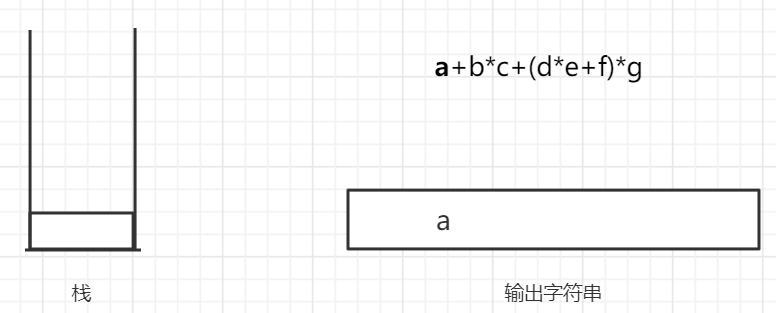

读取第一个操作符+，因为此时栈为空，所以将其放入栈中：

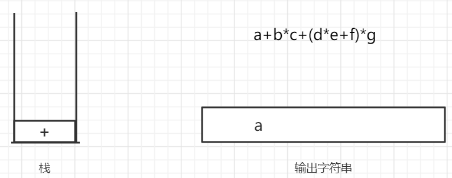

读取下一个操作数b，直接放入输出字符串：

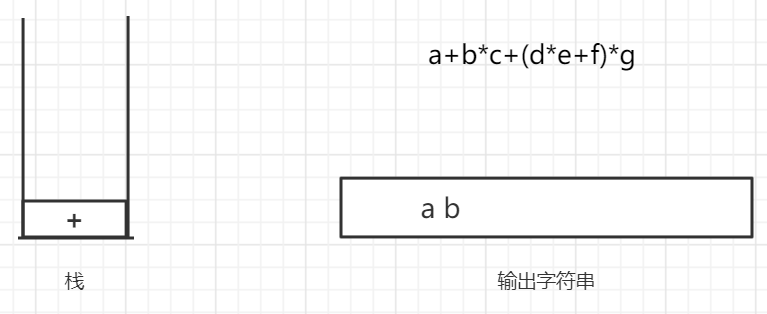

读取下一个操作符*，由于栈顶元素+的优先级比\*低，所以不需要出栈，之间将\*压入栈中，再继续读取操作数c，直接输出：

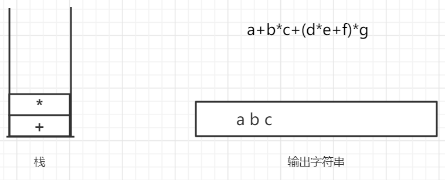

再读取下一个操作符+，此时栈中的操作符*和+都比它优先级高，所以出栈顺序输出，然后把读取到的+入栈：

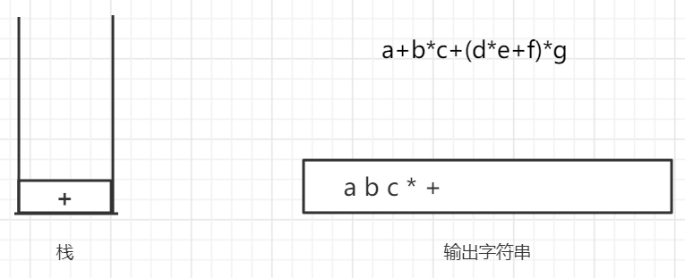

读取左括号，直接入栈，然后操作数d，直接输出：

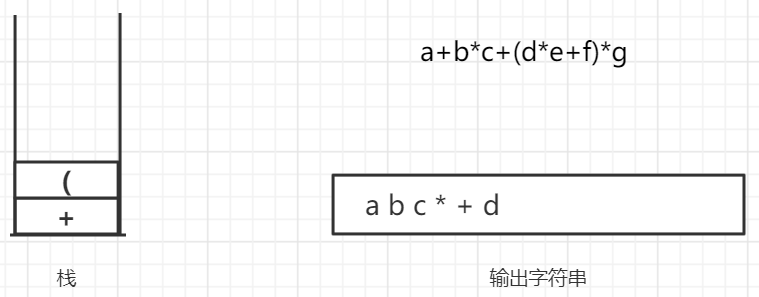

然后读取操作符*，由于左括号在栈中优先级最低，所以将\*直接入栈，然后读取操作数e直接输出：

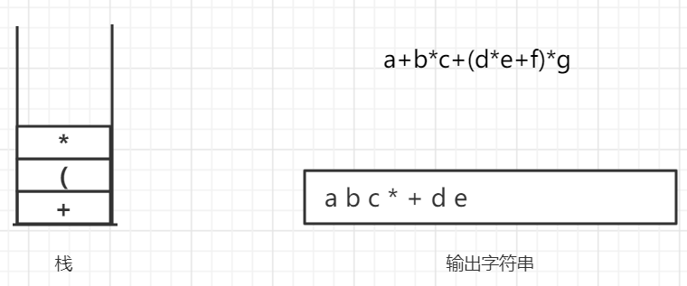

然后去读下一个操作符+，由于*的优先级高于+，所以将\*出栈输出，将+入栈，然后读取操作数f直接输出：

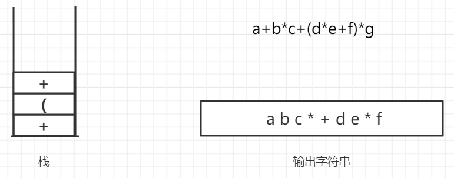

然后读取右括号，依次将栈中元素弹出输出，直至遇到左括号，左括号也弹出，但不输出，右括号不入栈：

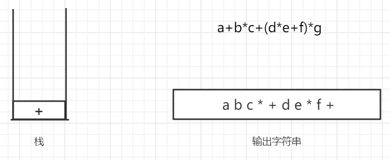

然后读取操作数*，由于\*的优先级高于+，所以直接入栈，然后读取操作数g，直接输出：

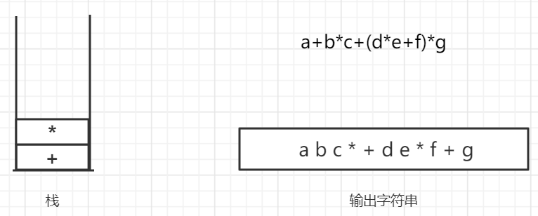

此时栈中还有操作符，依次弹出输出，最终结果就是后缀表达式：

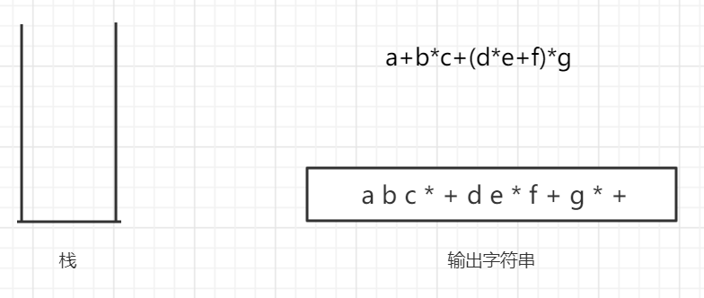


### 2.2 代码实现

首先是各操作符的优先级比较方法：

```java
//操作符优先级比较
public static boolean operatorPrioroty(String operatorOne, String operatorTwo){
    int position1 = -1;
    int position2 = -1;
    switch (operatorOne){
        case "+":position1=0;break;
        case "-":position1=1;break;
        case "*":position1=2;break;
        case "/":position1=3;break;
    }
    switch (operatorTwo){
        case "+":position2=0;break;
        case "-":position2=1;break;
        case "*":position2=2;break;
        case "/":position2=3;break;
    }

    boolean[][] priority = {
        {true,true,false,false},
        {true,true,false,false},
        {true,true,true,true},
        {true,true,true,true},
    };
    return priority[position1][position2];
}
```

然后是将操作数与操作符分开的方法，因为有些操作数有多位，并且可能包含小数点，所以不能简单地认为操作数就是一位数字：

```java
//将数字与操作符分离
public static List<String> splitDigitAndCharacter(String infixExpression){
    List<String> list = new LinkedList<>();
    StringBuilder stringBuilder = new StringBuilder();
    for (int i = 0;i <infixExpression.length(); i++){
        char ch = infixExpression.charAt(i);
        //是数字，则继续看下一位是不是数字
        if (Character.isDigit(ch) || ch == '.'){
            stringBuilder.append(ch);
        }else {
            // 不是数字，则将之前分离的数字加入到链表中，并且将操作符也加入到链表中
            if (stringBuilder.length() != 0) {
                //防止连续两个符号
                list.add(stringBuilder.toString());
                stringBuilder.delete(0, stringBuilder.length());
            }
            list.add(infixExpression.charAt(i)+"");
        }
    }
    list.add(stringBuilder.toString());
    return list;
}

```

然后就是中缀表达式转换为后缀表达式方法：

```java
 //将中缀表达式转换为后缀表达式
public static String infixExpressionToPostfixExpression(List<String> list) {
    StringBuilder postfixExpression = new StringBuilder();
    MyLinkedStack<String> operator = new MyLinkedStack<>();
    for (String s : list){
        if (!"+-*/()".contains(s)){
            //是数字，直接输出
            postfixExpression.append(s+" ");
        }else {
            // 是操作符
            if (!operator.isEmpty()) {
                if ("(".equals(s)){
                    //左括号，直接入栈
                    operator.push(s);
                }else if (")".equals(s)){
                    //右括号，将离栈顶最近的左括号上面的操作符输出
                    while ( !"(".equals(operator.top()) ){
                        postfixExpression.append(operator.pop()+" ");
                    }
                    operator.pop();       //左括号出栈，不输出
                }else {
                    //其他操作符，将优先级高的操作符 出栈输出
                    while ( !"(".equals(operator.top()) && operatorPrioroty(operator.top(),s)){
                        postfixExpression.append(operator.pop()+" ");
                        if (operator.isEmpty()){
                            break;
                        }
                    }
                    operator.push(s);
                }
            }else {
                //栈空，第一个操作符，直接入栈
                operator.push(s);
            }
        }
    }
    //最后需要把栈中的操作符输出
    while ( !operator.isEmpty()){
        postfixExpression.append(operator.pop()+" ");
    }
    return postfixExpression.toString();
}
```


### 2.3 结果

#### 2.3.1 例一

中缀表达式为：$9+(3-1)*3+10/2$

```java
public static void main(String[] args) {
    String res = infixExpressionToPostfixExpression(splitDigitAndCharacter("9+(3-1)*3+10/2")).trim();
    BigDecimal bigDecimal = PostfixExpressionSolve.computePostfixExpression(res);
    System.out.println("后缀表达式"+res);
    System.out.println("计算结果为："+bigDecimal);
}
```

结果：

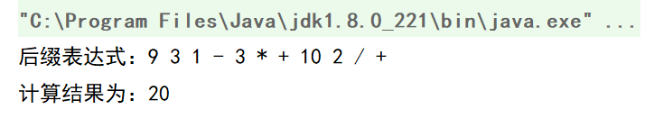


#### 2.3.2 例二

中缀表达式为：$1+2+3+4/2*2+(5+5)/2$

```java
public static void main(String[] args) {
    String res = infixExpressionToPostfixExpression(splitDigitAndCharacter("1+2+3+4/2*2+(5+5)/2")).trim();
    BigDecimal bigDecimal = PostfixExpressionSolve.computePostfixExpression(res);
    System.out.println("后缀表达式："+res);
    System.out.println("计算结果为："+bigDecimal);
}
```

结果：

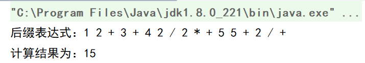


## 三、后缀表达式转换为中缀表达式

### 3.1 思路

在转换时，从左到右遍历后缀表达式，分情况处理：

- 如果读取到的是操作数，则直接入栈；
- 如果读取到的是操作符，则将栈顶两个元素出栈，与操作符拼接后再入栈，注意加括号来确定运算顺序；
- 最后栈中剩余的元素就是中缀表达式；


### 3.2 代码实现

```java
//后缀表达式转换为中缀表达式
public static String postfixExpressionToInfix(String[] list) {
    MyLinkedStack<String> stack = new MyLinkedStack<>();
    for (String s : list) {
        if ("+-*/".contains(s)){
            //是符号，则需要将栈顶两个表达式出栈，拼接后再入栈
            String string1 = stack.pop();
            String string2 = stack.pop();
            //注意顺序，先出栈的元素在后面，后出栈的元素在前面，加括号确定运算顺序
            String string = "("+string2 + s + string1+")";
            stack.push(string);
        }else {
            //是数字，直接入栈
            stack.push(s);
        }
    }
    return stack.pop();
}
```


### 3.3 结果

```java
public static void main(String[] args) {
    String expression = "1+2+3+4/2*2+(5+5)/2";
    String postfix =
        infixExpressionToPostfixExpression(splitDigitAndCharacter(expression))
        .trim();
    BigDecimal bigDecimal = PostfixExpressionSolve.computePostfixExpression(postfix);
    String infix = postfixExpressionToInfix(postfix.split(" "));
    System.out.println(expression + "=" +bigDecimal);
    System.out.println("后缀表达式：" + postfix);
    System.out.println("中缀表达式："+infix);
}
```

结果：

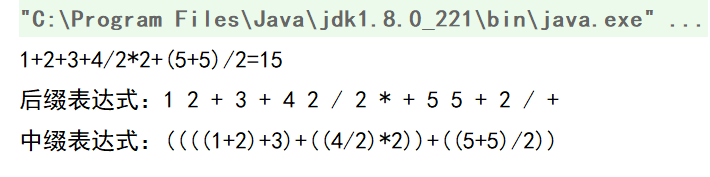


## 四、其他

中缀表达式与前缀表达式的转换，方式与后缀表达式的转换一样，只不过遍历顺序不同。

