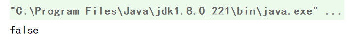
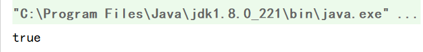

# 栈应用— —括号匹配

本文主要介绍利用栈进行括号匹配。


## 一、思路

依次读取括号字符，当遇到左括号(`(、[、{`)时，进栈；当遇到右括号(`)、]、}`)时，与栈顶元素匹配，若能够匹配，则将栈顶元素出栈，然后读取下一个字符，若不匹配，则直接返回`false`。当括号字符读取完成后，如果栈为空，则返回`true`，否则返回`false`。


## 二、代码实现

```java
public static boolean bracketMatch(String brackets){
    MyLinkedStack<String> stack = new MyLinkedStack<>();
    for (int i = 0;i<brackets.length();i++){
        if ("([{".contains(brackets.charAt(i)+"")){
            stack.push(brackets.charAt(i)+"");
        }else if (")".equals(brackets.charAt(i)+"")){
            if (stack.top().equals("(")){
                stack.pop();
            }else {
                return false;
            }
        }else if ("]".equals(brackets.charAt(i)+"")){
            if (stack.top().equals("[")){
                stack.pop();
            }else {
                return false;
            }
        }else if ("}".equals(brackets.charAt(i)+"")){
            if (stack.top().equals("{")){
                stack.pop();
            }else {
                return false;
            }
        }
    }
    return stack.isEmpty()?true:false;
}
```


## 三、结果

### 3.1 例一

```java
public static void main(String[] args) {
    String brackets = "[[]](()){[]{}";
    System.out.println(bracketMatch(brackets));
}
```

结果：




### 3.2 例二

```java
public static void main(String[] args) {
    String brackets = "[[]](()){[]{}}";
    System.out.println(bracketMatch(brackets));
}
```

结果：

