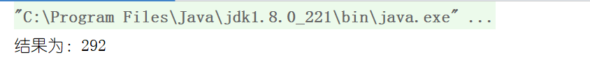

# 栈应用— —计算后缀表达式

本文主要介绍了如何利用栈来计算后缀表达式的结果。


## 一、思路

对于一串后缀表达式，依次读取每项，如果该项是数字，则入栈；如果该项是操作符，则连续取出栈顶的两个数字，然后进行计算，将计算结果入栈，再继续读取下一项。最后在栈中的数字即为结果。


## 二、代码实现

代码：

```java
public static BigDecimal computePostfixExpression(String expression) {
    String[] strings = expression.split(" ");
    MyLinkedStack<BigDecimal> stack = new MyLinkedStack<>();
    for (String string : strings) {
        //string 不是操作符，而是数字,压入栈中
        if ( !"+-*/".contains(string)){
            BigDecimal bigDecimal = new BigDecimal(Double.valueOf(string));
            stack.push(bigDecimal);
        }else {
            //string是操作符，取出栈顶两个数字，计算结果后再入栈
            BigDecimal bigDecimal1 = stack.pop();
            BigDecimal bigDecimal2 = stack.pop();
            BigDecimal bigDecimal = null;
            if ("+".equals(string)) {
                bigDecimal = bigDecimal1.add(bigDecimal2);
            }else if ("*".equals(string)){
                bigDecimal = bigDecimal1.multiply(bigDecimal2);
            }else if ("-".equals(string)){
                bigDecimal = bigDecimal1.subtract(bigDecimal2);
            }else if ("/".equals(string)){
                bigDecimal = bigDecimal1.divide(bigDecimal2);
            }
            stack.push(bigDecimal);
        }
    }
    return stack.pop();
}
```

测试：

```java
public static void main(String[] args) {
    String expression = "6 5 2 3 + 8 * + 3 + * 4 +";
    BigDecimal res = computePostfixExpression(expression);
    System.out.println("结果为："+res);
}
```

结果：

